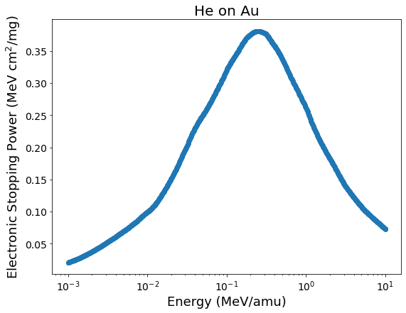
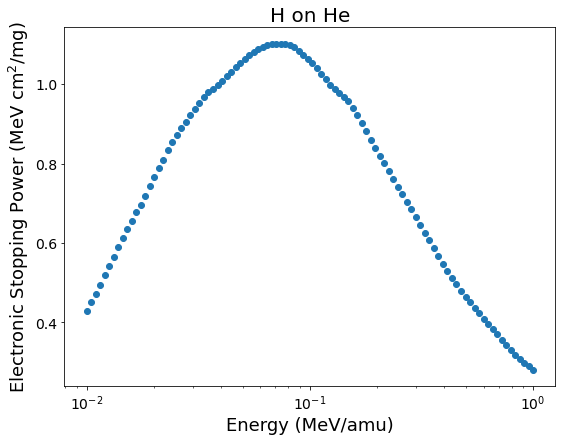

# SPNN - Stopping Power Neural Network

The SPNN is a deep neural network that allows the user to predict the electronic stopping power cross-section for any ion and target[^1] combination for a wide range of incident energies. The deep neural network was trained with many tens of thousands curated data points from the [IAEA database](https://www-nds.iaea.org/stopping/). See more details of the SPNN in this [publication](arxiv).

[^1]: *SPNN first release considers only mono-atomic targets.*

 [](https://opensource.org/licenses/MIT) [](https://github.com/ale-mendez/SPNN/actions/workflows/spnn_ci.yml/badge.svg) [](http://codecov.io/github/ale-mendez/SPNN?branch=master) 
 <!-- [](http://depsy.org/package/python/) -->

### Citation

```
@article{BivortHaiek2022,
author = {F. Bivort Haiek, A. M. P. Mendez, C. C. Montanari, D. M. Mitnik},
title = {ESPNN: The IAEA stopping power database neutral network. Part I: Monoatomic targets.},
year = {2022}
}
```
## Getting started:
### Install SPNN

The simplest way to install the SPNN is using pip. Ubuntu users can do:
```console
~$ pip install SPNN
```

### Run SPNN in a notebook

A basic tutorial of the SPNN package usage is given in [prediction.ipynb](workflow/prediction.ipynb). The package requires the following parameters as minimal input:

- ``projectile``: Chemical formula for the projectile
- ``projectile_mass``: Mass in amu for the projectile
- ``target``: Chemical formula for the target
- ``target_mass``: Mass in amu for the target

```python
import SPNN
SPNN.run_SPNN(projectile='H', projectile_mass=1.0, target='He', target_mass=4.002602)
```
    


The package automatically produces ``matplotlib`` figure and a sample file named ``XY_prediction.dat``, where ``X`` is the name of the projectile and ``Y`` is the name of the target system.

```console
~$ ls -a
.  ..  HHe_prediction.dat  prediction.ipynb 
```

#### Optional arguments:

The energy grid used for the SPNN calculation can be customized with arguments

- ``emin``: Minimum energy value in MeV/amu units (default: ``0.001``)
- ``emax``: Maximum energy value in MeV/amu units (default: ``10``)
- ``npoints``: Number of grid points (default: ``1000``)

Furthermore, the figure plotting and output-file directory-path can be modified via
- ``plot``: Prediction plot (default: ``True``)
- ``outdir``: Path to output folder (default: ``"./"``)


```python
SPNN.run_SPNN(projectile='He', projectile_mass=4.002602, target='Au', target_mass=196.966569, emin=0.01, emax=1, npoints=50)
```


    

    


### Run SPNN from terminal

The SPNN package can also be used from terminal with a syntaxis analogous to the above given:

```console
~$ python -m SPNN He 4.002602 Au 196.966569
```

Additional information about the optional arguments input can be obtained with the -h, --help flag:

```console
~$ python -m SPNN -h
```


##  Funding Acknowledgements

The following institutions financially support this work: the CONICET by the PIP2014-2016, the ANPCyT of Argentina, PICT 2014-2363, and the University of Buenos Aires by the projects UBACyT 20020130100 632BA and 477BA. CCM also acknowledges the financial support of the IAEA.